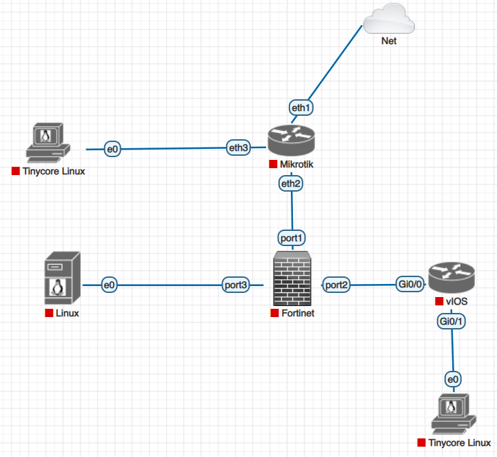

1. Topologi jaringan\

---

2. Tabel IP address

|Perangkat|	Interface	|IP Address| Gateway| Keterangan|
|---|---|---|---|---|
|MikroTik ISP	|ether1	|DHCP Client|	DHCP dari jaringan lab	|Terhubung ke Cloud / jaringan lab|
|MikroTik ISP	|ether2	10.10.10.1/30	-	Terhubung ke FortiGate port1|
|MikroTik ISP	|ether3	172.16.100.1/24	-	Gateway untuk Client-WAN|
|FortiGate|	port1	10.10.10.2/30	10.10.10.1	Interface WAN|
|FortiGate|	port2	10.20.20.1/30	-	Interface INSIDE ke Cisco|
|FortiGate                |	port3	192.168.20.1/24	-	Interface DMZ|
|Cisco Router	            |G0/0	10.20.20.2/30	-	Terhubung ke FortiGate port2|
|Cisco Router	            |G0/1	192.168.10.1/24	-	Gateway LAN|
|Client LAN Tinycore Linux|	eth0	|192.168.10.10/24|	192.168.10.1	|Client internal|
|Client WAN Tinycore Linux|	eth0|	172.16.100.10/24	|172.16.100.1	|Client luar|
|Ubuntu Server DMZ|	eth0  ens3	|192.168.20.10/24|	192.168.20.1	|Web server DMZ|

---

3. Konfigurasi tiap perangkat (+ screenshot)

---

4. Hasil pengujian (+ screenshot)\

---
Analisis dan kesimpulan
